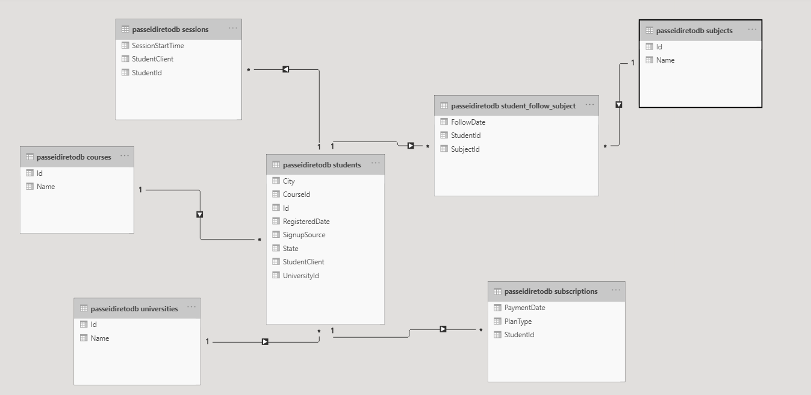
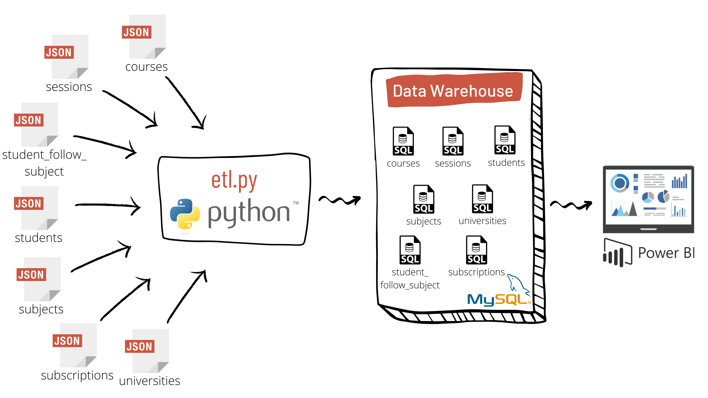
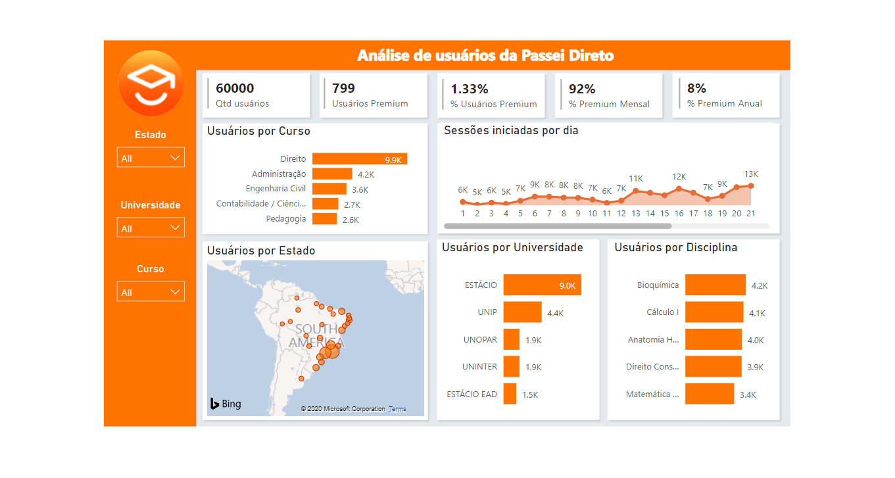

# Análise de perfil de usuários do Passei Direto (Parte I)

## Introdução

Este projeto tem como objetivo definir a modelagem de uma base analítica com a finalidade de entender melhor as características dos usuários da Passei Direto.

Definindo um star chema e escrevendo o pipeline ETL, os dados baseados em arquivos json são transferidos para uma base de dados para análises futuras. 

## Data Schema and ETL Pipeline

### Data Schema

Utilizando os arquivos courses.json, sessions.json, student_follow_subject.json, students.json, subjects.json, subscription.json, universities.json foi feita uma modelagem de dados como mostrado abaixo, que inclui

- Uma tabela fato: **students**, e 
- Seis tabelas dimensões: **courses**, **sessions**, **student_follow_subject**, **subjects**, **subscription**, e **universities**.

### ETL Pipeline

O ETL pipeline extrai os dados dos arquivos e faz a inserção nas tabelas do MySQL utilizando o script `etl.py`, como você pode observar na imagem abaixo

Sabendo que trata-se de uma base estática e que no mundo real esses dados são populados constantemente, para que a base analítica seja mantida atualizada podemos utilizar um orquestrador de jobs, como o `Airflow`, para selecionar somente os dados relevantes em um dado período de tempo para o pipeline.

Com isso, conseguimos definir o escopo do job para ser executado apenas com os dados do período a partir da última execução do pipeline de dados – nos ajudando a aumentar a qualidade e a acurácia das análises realizadas pelo nosso pipeline.

A definição de um período de tempo apropiado para a `schedule` depende de algums fatores, como:

- O tamanho do conjunto de dados, em média, para um determinado período
- Quão frequente as análises precisam ser realizadas

## Como executar

### Pré-requisitos

Se você deseja executar esse projeto em sua máquina, você deve finalizar os seguintes passos primeiro.

- Instalar `MySQL` em localhost.
- Criar usuário `root` com senha `admin`.
- Instalar Python 3.
- Instalar as bibliotecas:
  - mysql.connector==8.0.21
  - pandas==1.0.5

### Instruções

1. Criar database/tabelas: `python create_tables.py`
2. Enviar os dados dos arquivos, armazenando na base de dados: `python etl.py`

## Arquivos do projeto

- **data/BASE_A**
  - **courses.json**
    - lista de cursos cadastrados no Passei Direto
  - **sessions.json**
    - visitas que os usuários fizeram ao longo do mês
  - **student_follow_subject.json**
    - disciplinas que cada usários está seguindo
  - **students.json**
    - amostra de usuários que acessaram o Passei Direto em Novembro de 2017
  - **subjects.json**
    - lista de disciplinas cadastradas no Passei Direto
  - **subscriptions.json**
    - assinaturas dos usuários que aderiram ao plano premium do Passei Direto
  - **universities.json**
    - lista de universidades cadastradas no Passei Direto
- **images**
  - Imagens do documento
- **create_tables.py**
  - Quando executado, esse script irá
    - `drop` database `passeidiretodb`
    - `create` database `passeidiretodb`
    - `drop` tables if exists
    - `create` tables if not exists
- **etl.py**
  - Script para implementaçao do processo de ETL.
  - Quando executado, esse script irá 
  Quando executado, esse script irá:
    - Iterar entre todos arquivos dentro de data/BASE_A para extrair os dados de cada arquivo e inseri-los em suas respectivas tabelas na base de dados do MySQL
- **sql_queries.py**
  - Contém todas instruções DLL definidas
- **README.md**
  - Descrição e instruções sobre o projeto

## Dashboard

É possível realizar várias análises de perfil de usuários através do dashboard desenvolvido no Power BI através desse [link](https://app.powerbi.com/view?r=eyJrIjoiYzAzMjE0ZGUtZGM3Yy00NjI4LThiOWYtMDBjNWJkNmJjYjI2IiwidCI6ImYwMjAyMmRkLWI3YmYtNGU3OC04MjFjLWFmN2VlMjk2ZTgyNiJ9).

A figura abaixo trás uma captura de tela do dashboard.

# Análise de perfil de usuários do Passei Direto (Parte II)

## Introdução
Esta etapa do projeto tem como objetivo fazer o processamento da `BASE A` juntamente com a `BASE B` para extrair informações importantes que permitam analisar o que os usuários do Passei Direto acessam em sua plataforma e como fazem isso.

## Como executar

### Pré-requisitos

Se você deseja executar esse projeto em sua máquina, você deve finalizar os seguintes passos primeiro.

- Instalar Python 3.
- Instalar Pyspark==3.0.1.

### Instruções

1. Executar todas células do notebook `user_activity.ipynb`.

## Arquivos do projeto

- **data/BASE_B**
  - **part-[0000x].json**
    - Eventos de Page View que os usuários realizaram no dia 16 de Novembro de 2017.
- **user_activity.ipynb**
  - Notebook com as análises de atividades de usuários na plataforma do Passei Direto.
